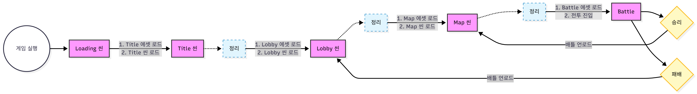

-----

# Project "Everything" - Roguelike Deckbuilder

**Slay the Spire 스타일의 턴제 덱빌딩 로그라이크 핵심 시스템 구현 (1인 개발)**

## 1. 프로젝트 개요

  * **엔진:** Unity 6000.0.58f2
  * **언어:** C\#
  * **인원:** 1인 개발
  * **개발 기간:** 2025.09 \~ 2025.10(약 2개월)
  * **목표:**
      * 데이터(SO)와 로직의 분리를 통한 확장성 확보
      * FSM 기반의 안정적인 턴제 전투 로직 구현
      * Addressables 기반의 '에셋 프리로딩(Pre-loading)' 시스템 구축

<br>

## 2. 기술 스택 (Tech Stack)

| 분류 | 기술 | 구현 내용 |
| :--- | :--- | :--- |
| **Architecture** | **ScriptableObject** | 카드/스킬/적 데이터를 SO로 정의, 로직(`GameEffectSO`) 분리 |
| **Pattern** | **State Machine (FSM)** | `IBattleState` 인터페이스 기반 전투 흐름 제어 |
| **Pattern** | **Event Bus** | `Action`을 활용한 전역 이벤트(`SystemEvent`, `BattleEvent`) 처리 |
| **System** | **Addressables** | 씬 전환 시 에셋 프리로딩(Pre-loading) 및 메모리 해제 |
| **Optimization** | **Object Pooling** | 커스텀 `AddressableObjectPooler` 구현 |
| **Algorithm** | **Map Generation** | 노드 그래프 기반 절차적 맵 생성 및 경로 검증 |
| **Data** | **JSON** | 게임 데이터 직렬화 및 저장/로드 |

<br>

## 3. 핵심 구현 사항 (Key Implementations)

### 3-1. 데이터 기반 아키텍처 (ScriptableObject)

  * **구조:** 데이터(`CardSO`)와 행위(`GameEffectSO`)를 분리하여 유연한 카드 생성 환경 구축.
  * **구현:** `GameEffectSO`를 상속받은 `EffectDamage`, `EffectShield` 등의 에셋을 조합하여 코딩 없이 신규 카드 생성 가능.

<!-- end list -->

```csharp
public class CardSO : ScriptableObject {
    public int cost;
    ...
    public List<CardEffect> effects; // 효과 로직 리스트 (데이터 조합)
}
```

### 3-2. 전투 상태 머신 (FSM)

  * **구조:** `IBattleState`(`Enter`, `Execute`, `Exit`) 인터페이스를 통한 상태 캡슐화.
  * **구현:** `BattleManager`는 상태 전환만 요청하며, 각 상태(`PlayerTurn`, `EnemyTurn` 등)가 독립적으로 로직을 수행.

### 3-3. 이벤트 버스 시스템 (Event Bus)

  * **목적:** 객체 간 결합도 최소화.
  * **구현:** `Action` 델리게이트를 사용한 정적 이벤트 클래스 구현.
      * `BattleEvent`: 전투 관련 이벤트 (턴 시작, 데미지 처리 등)
      * `SystemEvent`: 시스템 관련 이벤트 (저장, 씬 로드 등)

<!-- end list -->

```csharp
// BattleManager는 UI를 몰라도 이벤트만 발생시킴
public void StartPlayerTurn() => BattleEvent.OnTurnStart?.Invoke(TurnOwner.Player);

// UI는 이벤트를 구독하여 작동
BattleEvent.OnTurnStart += UpdateTurnUI;
```

### 3-4. 씬 로딩 최적화 (Scene Asset Pre-loading)

  * **목적:** 끊김 없는(Seamless) 씬 전환 경험 제공. Memory Profiler를 보고 성능에 크게 미치지 않는 것 비교 후 Pre-Loading 도입.
  * **구현:** `SceneAssetLoader`를 통해 다음 씬에 필요한 에셋(UI, 캐릭터, 환경)을 `Addressables.LoadAssetAsync`로 미리 메모리에 적재.


<br>

## 4. 프로젝트 구조 (Folder Structure)

```
Assets/Scripts
├── 01_Core            # FSM, GameSystem, Singleton, Event(Event Bus)
├── 02_Data            # ScriptableObject 데이터 정의 (Card, Enemy, Relic)
├── 03_GamePlay        # 인게임 로직 (BattleManager, MapSystem)
│   └── Scene          # 씬 관리 및 SceneAssetLoader (Pre-loading 로직)
├── 04_UI              # UI 로직 (Canvas, Button, Interaction)
└── 05_Utils           # 유틸리티 (ObjectPooler, AssetLoader, SaveLoadManager)
```

<br>

## 5. 개선 계획 (Future Improvements)

  * **CSV 데이터 파이프라인 구축:**
      * 현재 SO 수작업 생성 방식을 개선하기 위해, .csv 파일을 파싱하여 SO를 자동 생성하는 에디터 툴 제작 예정.
  * **UniTask 도입:**
      * 기존 `Coroutine` 및 `Task`를 Unity에 최적화된 `UniTask`로 마이그레이션하여 GC 감소 및 비동기 로직 가독성 향상.
  * **UI/UX 리소스 고도화:**
      * 현재 프로토타입 UI를 Pixel Art 스타일 전용 리소스로 교체.
      * 설치된 `DOTween` 패키지를 활용하여 카드 사용 및 피격 시의 타격감/연출 보강.

-----
